# Оптимізація зображень за допомогою [Squoosh](https://squoosh.app/)

## Виконав:  
**Лапін Микита**  
**Група: ІПЗ-2.03**

---

Посилання на звіт у [GoogleDocs](https://docs.google.com/document/d/1hSe84_EHsIP_7l0-9sNcZAwktLrZeaPT59A41KiEaG8/edit?usp=sharing).
Усі файли доступні в репозиторії на [GitHub](https://github.com/ni-cookie/image-optimization-squoosh).

---

## Опис вихідних зображень
| Зображення                | Формат | Вага                  | Розмір        |
|---------------------------|--------|------------------------|---------------|
| **Графічне зображення з текстом** | PNG    | 52013 bytes / 53 KB   | 1200×900      |
| **Фотографія**           | HEIC   | 1138131 bytes / 1.1 MB | 2316×3088     |
| **Скріншот**             | PNG    | 3245717 bytes / 3.2 MB | 3600×2338     |

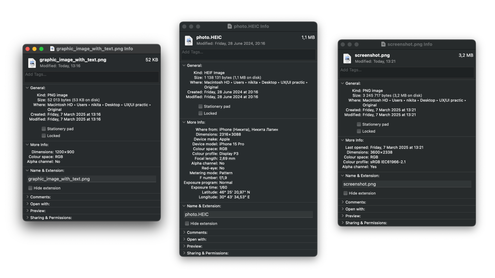

**Оригінальні файли**

**Оригінальне графічне зображення з текстом**

[Оригінальна фотографія](https://github.com/ni-cookie/image-optimization-squoosh/blob/main/workshop_1/images/Original/photo.HEIC)

**Оригінальна фотографія (Оскільки Markdown не підтримує формат .HEIC, то просто залишу посилання на нього в репозиторії.)**

**Оригінальний скріншот**

---

## Порівняння після різних типів стиснення

### **PNG (Lossless)**
| Зображення | Формат | Оригінальна вага | Вага після стиснення | Розмір |
|------------|--------|------------------|----------------------|--------|
| Графічне зображення з текстом | PNG | 53 KB | 78 KB | 1200x900 |
| Фотографія | PNG | 1.1 MB | 8.6 MB | 2316x3088 |
| Скриншот | PNG | 3.2 MB | 3 MB | 3600x2338 |

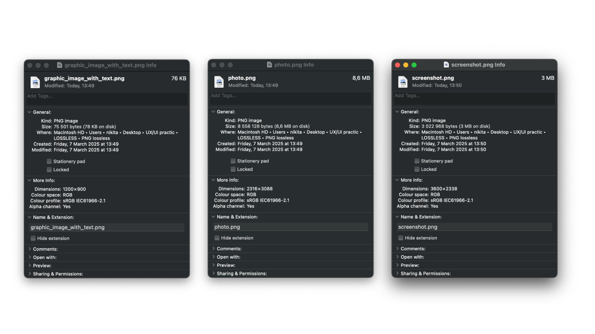

**PNG (Lossless) файли**

/graphic_image_with_text.png)

**PNG (Lossless) графічне зображення з текстом**

/photo.png)

**PNG (Lossless) фотографія**

/screenshot.png)

**PNG (Lossless) скріншот**

**Висновок:**  
Стиснення PNG lossless неефективне, оскільки файли або збільшуються в розмірі, або зменшуються незначно. Найкращий результат показав формат зображення «Скріншот», але особисто моя думка він не ідеальний. Всього лише на 6.86% зображення зменшилося. 

---

### **WebP (Lossless)**
| Зображення                | Формат | Оригінальна вага       | Вага після стиснення         | Розмір        |
|---------------------------|--------|------------------------|----------------------|---------------|
| **Графічне зображення з текстом** | WebP   | 52013 bytes / 53 KB   | 17982 bytes / 18 KB  | 1200×900      |
| **Фотографія**           | WebP   | 1138131 bytes / 1.1 MB | 4084542 bytes / 4.1 MB | 2316    ×3088     |
| **Скріншот**             | WebP   | 3245717 bytes / 3.2 MB | 1210464 bytes / 1.2 MB | 3600×2338     |

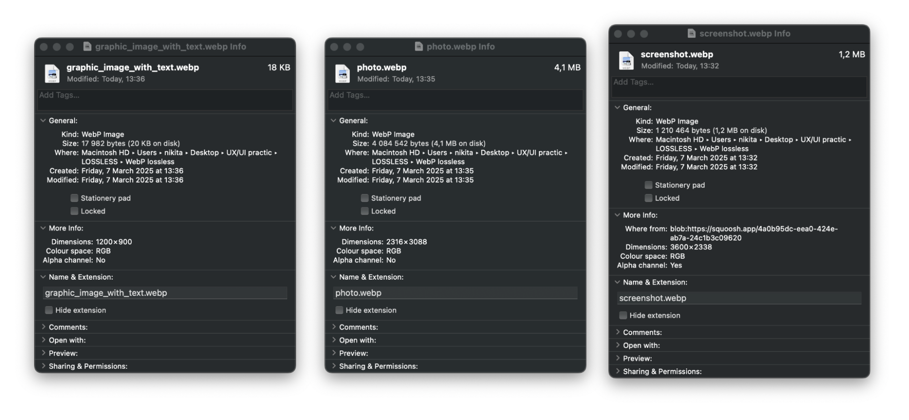

**WebP (Lossless) файли**

/graphic_image_with_text.webp)

**WebP (Lossless) графічне зображення з текстом**

/photo.webp)

**WebP (Lossless) фотографія**

/screenshot.webp)

**WebP (Lossless) скріншот**

**Висновок:**  
Формат WebP відмінно підходить для «Графічного зображення з текстом» і «Скріншота», але для фотографії він збільшує вагу.

---

**Висновки PNG та WebP (Lossless):**
Для того, щоб зменшити вагу зображення типу «Скріншот» і «Графічне зображення з текстом», змінивши його формат без втрати якості, найкраще підійде варіант «WebP» з його середнім показником різницею у вазі до і після стиснення в 64%.  

---

### **AVIF (Lossy)**
### Графічне зображення з текстом

| Формат | Якість | Оригінальна вага       | Вага після стиснення        | Розмір        |
|--------|--------|------------------------|---------------------|---------------|
| AVIF   | 50%    | 52013 bytes / 53 KB   | 13727 bytes / 16 KB  | 1200×900      |
| AVIF   | 75%    | 52013 bytes / 53 KB   | 19594 bytes / 20 KB  | 1200×900      |
| AVIF   | 100%   | 52013 bytes / 53 KB   | 39538 bytes / 41 KB  | 1200×900      |

### Фотографія

| Формат | Якість | Оригінальна вага        | Вага після стиснення        | Розмір        |
|--------|--------|------------------------|---------------------|---------------|
| AVIF   | 50%    | 1138131 bytes / 1.1 MB | 184257 bytes / 184 KB | 2316×3088     |
| AVIF   | 75%    | 1138131 bytes / 1.1 MB | 553700 bytes / 557 KB | 2316×3088     |
| AVIF   | 100%   | 1138131 bytes / 1.1 MB | 2261915 bytes / 2.3 MB | 2316×3088     |

### Скріншот

| Формат | Якість | Оригінальна вага        | Вага після стиснення        | Розмір        |
|--------|--------|------------------------|---------------------|---------------|
| AVIF   | 50%    | 3245717 bytes / 3.2 MB | 135036 bytes / 135 KB | 3600×2338     |
| AVIF   | 75%    | 3245717 bytes / 3.2 MB | 198220 bytes / 198 KB | 3600×2338     |
| AVIF   | 100%   | 3245717 bytes / 3.2 MB | 638760 bytes / 639 KB | 3600×2338     |

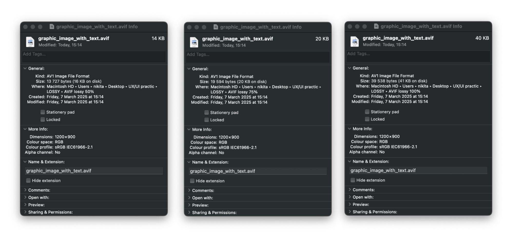

**Файли "Графічне зображення з текстом" AVIF 50%/75%/100%**

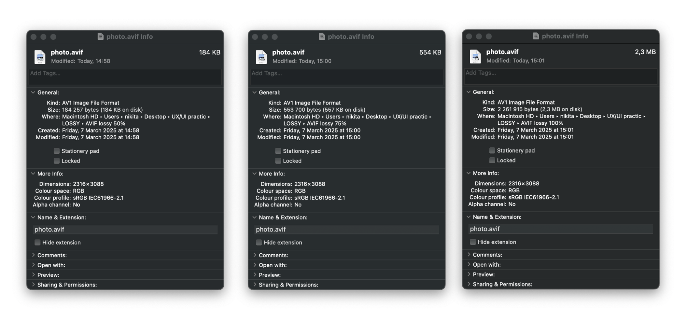

**Файли "Фотографія" AVIF 50%/75%/100%**

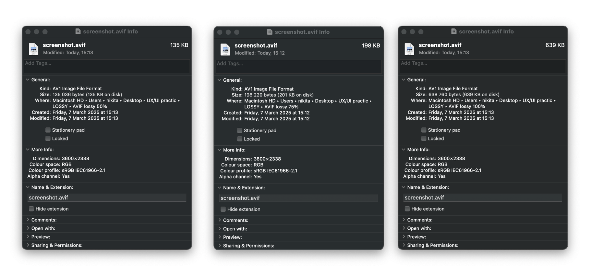

**Файли "Скріншот" AVIF 50%/75%/100%**

### **AVIF (Lossy)** 50%

### **AVIF (Lossy)** 75%

### **AVIF (Lossy)** 100%

## Висновки AVIF 50%/75%/100% lossy  

## **“Графічне зображення з текстом” показники:**  
- **Якість 50%** - вага зменшилася на **83.81%**  
- **Якість 75%** - вага зменшилася на **51.35%**  
- **Якість 100%** - вага зменшилася на **23.98%**  

Щодо елементів, які є на зображенні, то **ідеал – це 75% якості**,  
бо за **50% якості** деякі об'єкти **втрачають свою форму (розпливаються)**.  
Якщо потрібно більше якості, то варіант **зі 100% підійде краще**,  
оскільки якість у цього варіанту **як в оригіналу**.  

---

## **“Фотографія” показники:**  
- **Якість 50%** - вага зменшилася на **73.61%**  
- **Якість 75%** - вага зменшилася на **62.33%**  
- **Якість 100%** - вага збільшилася на **98.74%**  

Щодо елементів, які є на зображенні, то **ідеал – це 75% якості**,  
бо за **50% якості** елементи **розпливаються при зумі зображення**.  
Якщо потрібно більше якості, то варіант **зі 100% підійде краще**,  
оскільки якість у цього варіанту **як в оригіналу**,  
але вага **більше ніж в оригіналу майже в 2 рази**.  

---

## **“Скріншот” показники:**  
- **Якість 50%** - вага зменшилася на **95.84%**  
- **Якість 75%** - вага зменшилася на **93.89%**  
- **Якість 100%** - вага зменшилася на **80.32%**  

**Найкращий результат**. Усі варіанти **добре**.  
Найкраще використовувати варіант **зі 100% якістю зображення**,  
оскільки вага зображення **зменшилася більш ніж на 80%**,  
а **якість залишилася такою самою**.  
Щодо варіантів **із 50% і 75%**, то за якістю вони **трохи різняться**  
під час масштабування зображення, а вага **зменшилася практично на рівний відсоток**.  

---

## **Підсумок:**  
Найкраще використовувати **це розширення файлу** для **стиснення зображень**  
типу **«Скріншот»**, на другому місці – **«Графічне зображення з текстом»**,  
і на останньому – **«Фотографія»**.  

Особисто **я використовував би цей формат для «Скріншотів»**,  
оскільки **стиснення без втрати якості практично в 2 рази дуже приваблює**.  

---

### **MozJPEG (Lossy)**
### Графічне зображення з текстом

| Формат   | Якість | Оригінальна вага       | Вага після стиснення        | Розмір        |
|----------|--------|------------------------|---------------------|---------------|
| MozJPEG  | 50%    | 52013 bytes / 53 KB   | 36746 bytes / 37 KB  | 1200×900      |
| MozJPEG  | 75%    | 52013 bytes / 53 KB   | 49926 bytes / 53 KB  | 1200×900      |
| MozJPEG  | 100%   | 52013 bytes / 53 KB   | 222977 bytes / 225 KB | 1200×900      |

### Фотографія

| Формат   | Якість | Оригінальна вага        | Вага після стиснення        | Розмір        |
|----------|--------|------------------------|---------------------|---------------|
| MozJPEG  | 50%    | 1138131 bytes / 1.1 MB | 288381 bytes / 291 KB | 2316×3088     |
| MozJPEG  | 75%    | 1138131 bytes / 1.1 MB | 523861 bytes / 524 KB | 2316×3088     |
| MozJPEG  | 100%   | 1138131 bytes / 1.1 MB | 3427240 bytes / 3.4 MB | 2316×3088     |

### Скріншот

| Формат   | Якість | Оригінальна вага        | Вага після стиснення        | Розмір        |
|----------|--------|------------------------|---------------------|---------------|
| MozJPEG  | 50%    | 3245717 bytes / 3.2 MB | 322069 bytes / 324 KB | 3600×2338     |
| MozJPEG  | 75%    | 3245717 bytes / 3.2 MB | 460753 bytes / 463 KB | 3600×2338     |
| MozJPEG  | 100%   | 3245717 bytes / 3.2 MB | 2320188 bytes / 2.3 MB | 3600×2338     |

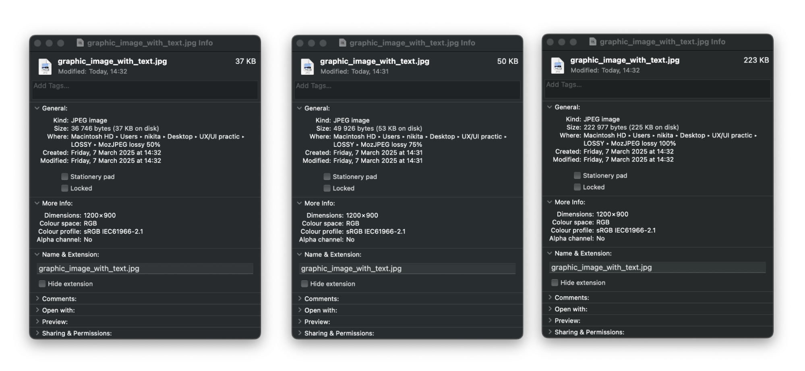

**Файли "Графічне зображення з текстом" MozJPEG 50%/75%/100%**

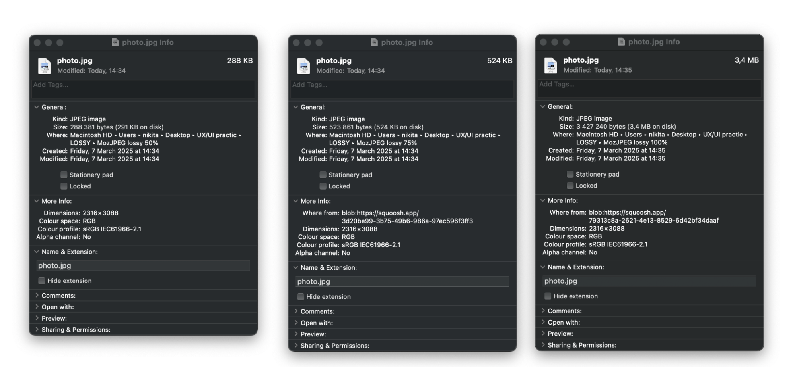

**Файли "Фотографія" MozJPEG 50%/75%/100%**

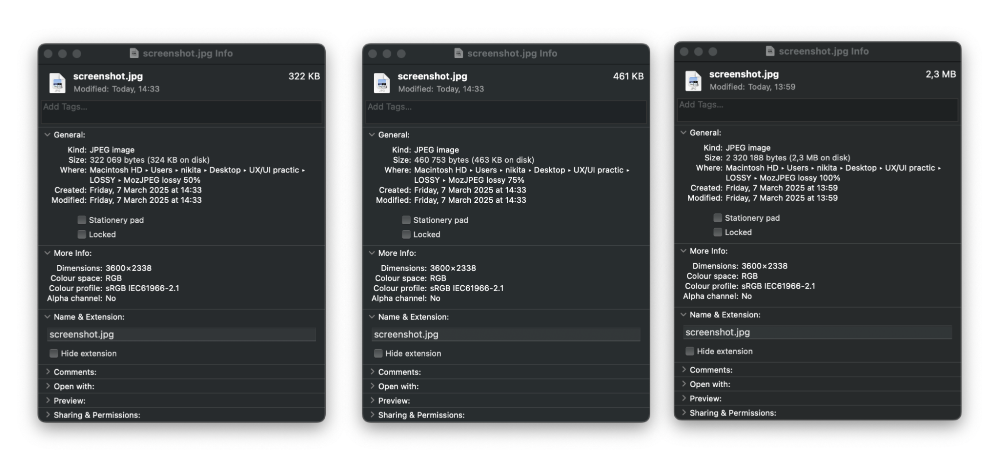

**Файли "Скріншот" MozJPEG 50%/75%/100%**

### **MozJPEG (Lossy)** 50%

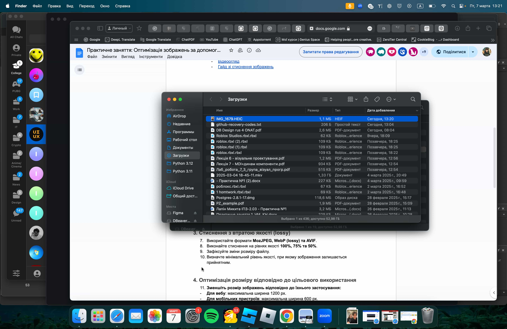

### **MozJPEG (Lossy)** 75%

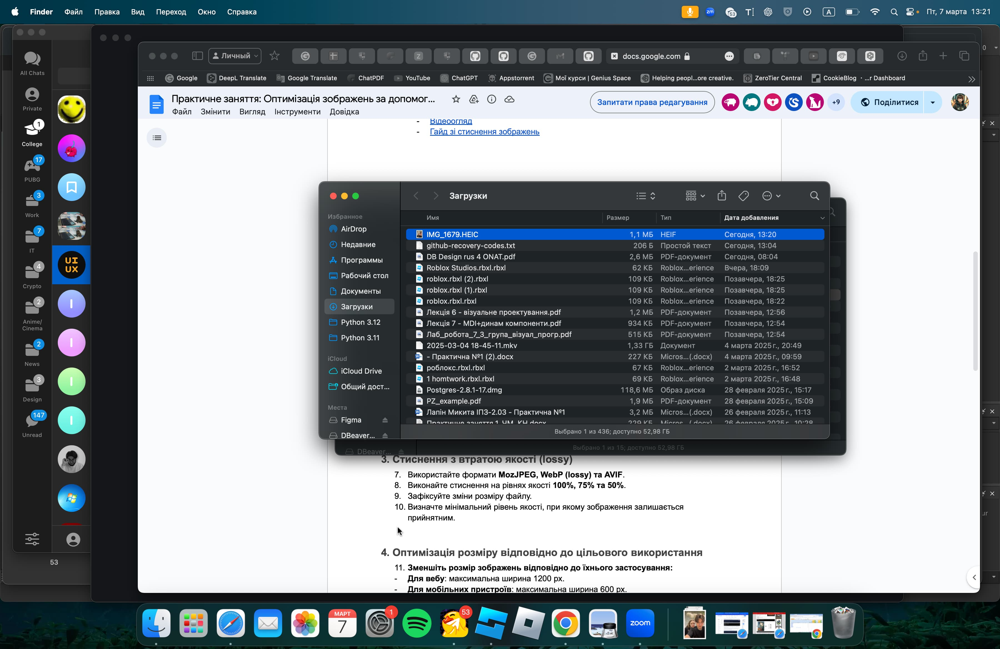

### **MozJPEG (Lossy)** 100%

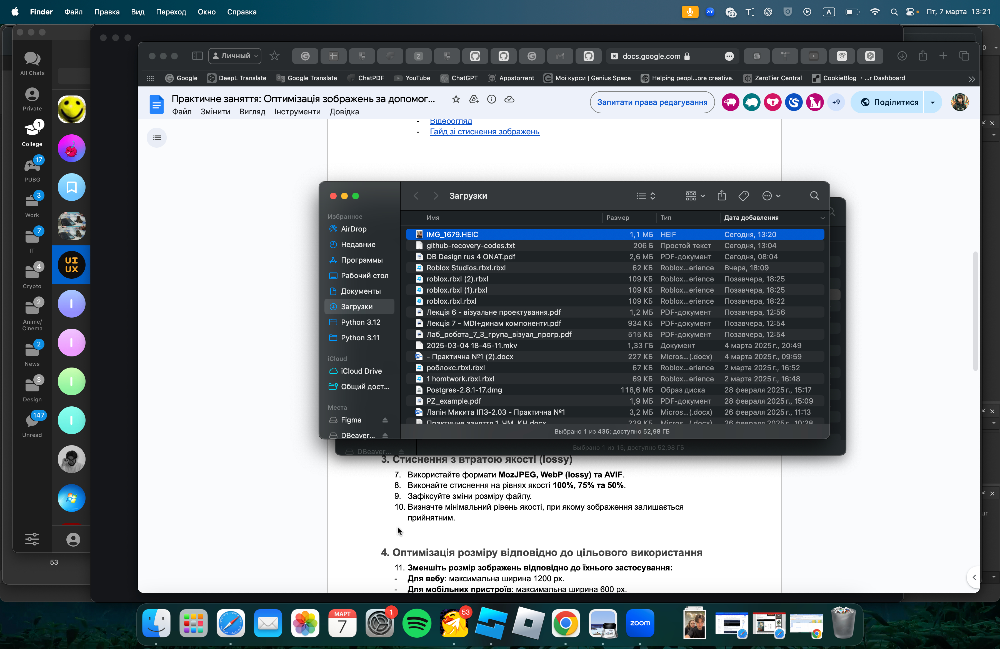

## Висновки MozJPEG 50%/75%/100% lossy  

## **“Графічне зображення з текстом” показники:**  
- **Якість 50%** - вага зменшилася на **29.35%**  
- **Якість 75%** - вага зменшилася на **4.01%**  
- **Якість 100%** - вага збільшилася на **328.69%**  

Якість на **50% і 75% огидна**. Навіть без зумування зображення можна помітити зміни в гірший бік.  
При **100% якості вага збільшилася більш ніж у 4 рази**.  
**Категорично не підходить** формат для такого типу зображень.  

---

## **“Фотографія” показники:**  
- **Якість 50%** - вага зменшилася на **74.66%**  
- **Якість 75%** - вага зменшилася на **53.97%**  
- **Якість 100%** - вага збільшилася на **201.13%**  

Якість на **50%, 75% і 100%** зображення знаходиться приблизно на одному рівні.  
50% і 75% так точно, але 100% все ж є відмінність, хоча вони не такі критичні.  
Що з приводу ваги, то найкращий результат, як не дивно, показала **якість 50%**.  
Якщо враховувати, що вага **зменшилася практично на 75%**, то це досить приємно.  

**Хороший формат** для зображення типу «Фотографія», але **100% якості** – вага збільшилася **більше ніж на 200%**, що досить неприємно.  

---

## **“Скріншот” показники:**  
- **Якість 50%** - вага зменшилася на **90.08%**  
- **Якість 75%** - вага зменшилася на **85.80%**  
- **Якість 100%** - вага зменшилася на **28.52%**  

Якість на **50% і 75%** зображення перебуває приблизно на одному рівні,  
але якщо почати **зумувати**, то стає **жахливо**, як і на зображенні типу «Графічне зображення з текстом».  
**100% показав хороший результат** тим, що **без втрати якості** стиснув вагу зображення **більше ніж на 25%**.  
**Добре підійде для зображень** типу «Скріншот».  

---

## **Загальний висновок:**  
Цей формат **найкраще підходить** для зображення типу **«Фотографія»**.  
Огидно показав себе цей формат під час роботи з **будь-яким текстом або графічними об'єктами**.  

---

### **WebP (Lossy)**
### Графічне зображення з текстом

| Формат | Якість | Оригінальна вага       | Вага після стиснення        | Розмір        |
|--------|--------|------------------------|---------------------|---------------|
| WebP   | 50%    | 52013 bytes / 53 KB   | 21926 bytes / 25 KB  | 1200×900      |
| WebP   | 75%    | 52013 bytes / 53 KB   | 26514 bytes / 29 KB  | 1200×900      |
| WebP   | 100%   | 52013 bytes / 53 KB   | 61464 bytes / 66 KB  | 1200×900      |

### Фотографія

| Формат | Якість | Оригінальна вага        | Вага після стиснення        | Розмір        |
|--------|--------|------------------------|---------------------|---------------|
| WebP   | 50%    | 1138131 bytes / 1.1 MB | 221796 bytes / 225 KB | 2316×3088     |
| WebP   | 75%    | 1138131 bytes / 1.1 MB | 339586 bytes / 340 KB | 2316×3088     |
| WebP   | 100%   | 1138131 bytes / 1.1 MB | 1900040 bytes / 1.9 MB | 2316×3088     |

### Скріншот

| Формат | Якість | Оригінальна вага        | Вага після стиснення        | Розмір        |
|--------|--------|------------------------|---------------------|---------------|
| WebP   | 50%    | 3245717 bytes / 3.2 MB | 243696 bytes / 246 KB | 3600×2338     |
| WebP   | 75%    | 3245717 bytes / 3.2 MB | 296816 bytes / 299 KB | 3600×2338     |
| WebP   | 100%   | 3245717 bytes / 3.2 MB | 807502 bytes / 811 KB | 3600×2338     |

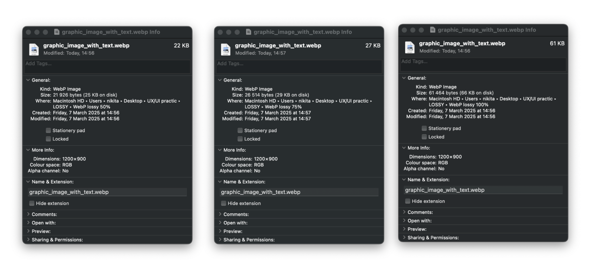

**Файли "Графічне зображення з текстом" WebP 50%/75%/100%**

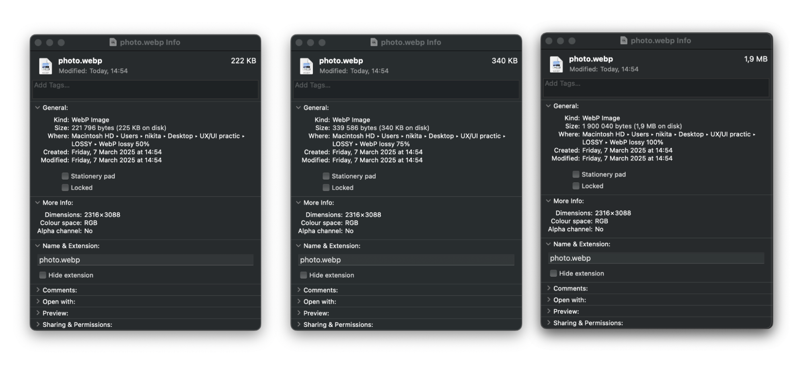

**Файли "Фотографія" WebP 50%/75%/100%**

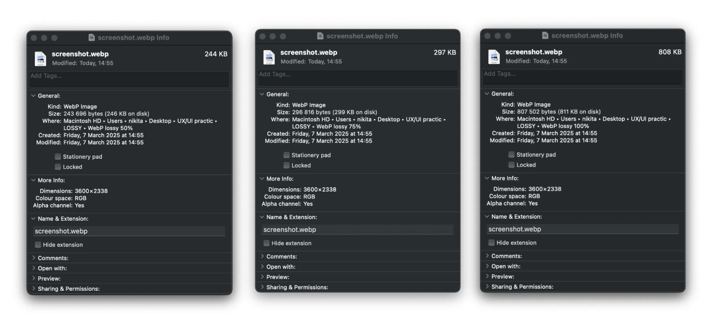

**Файли "Скріншот" WebP 50%/75%/100%**

### **WebP (Lossy)** 50%

### **WebP (Lossy)** 75%

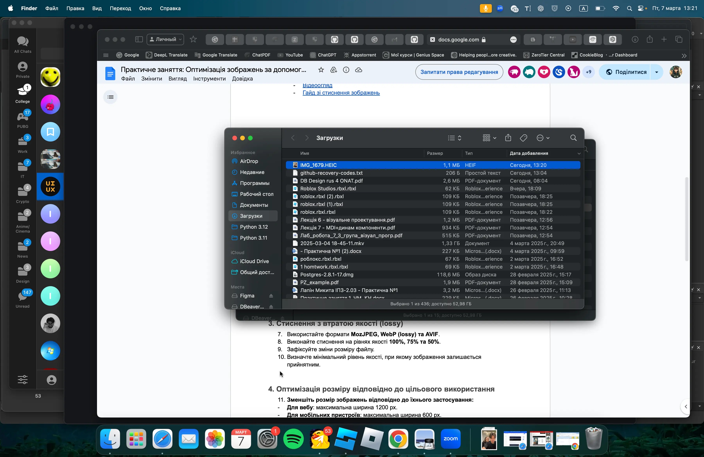

### **WebP (Lossy)** 100%

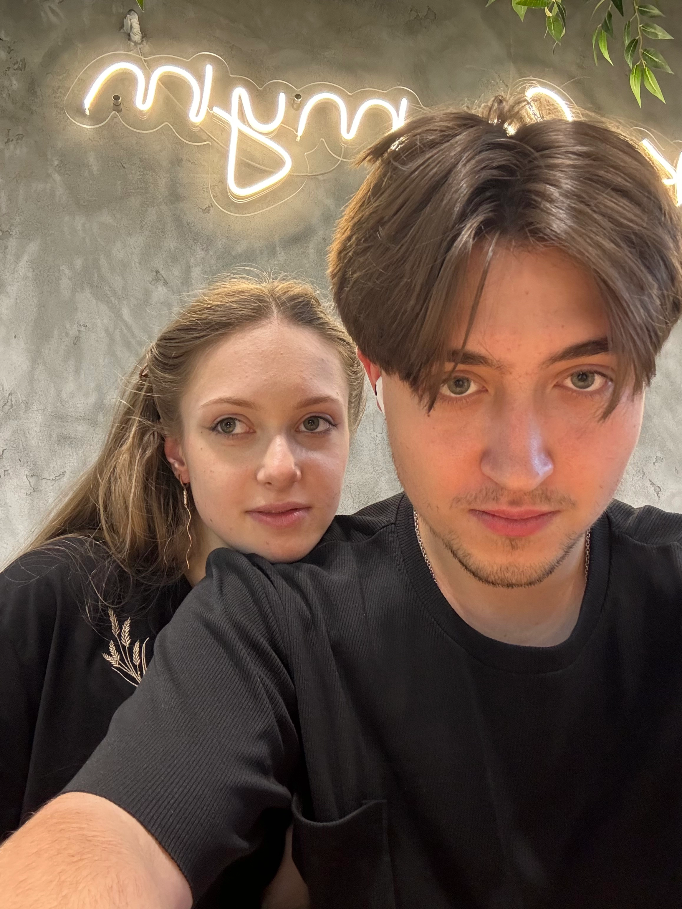

## Висновки WebP 50%/75%/100% lossy

## “Графічне зображення з текстом” показники:
- **Якість 50%** - вага зменшилася на **57.85%**  
- **Якість 75%** - вага зменшилася на **49.02%**  
- **Якість 100%** - вага збільшилася на **18.17%**  

Якість на 50% і 75% практично однакова, маленькі й тонкі лінії розпливаються, навколо тексту з'являються глітчі та розплави.  
Навіть без зумування зображення можна помітити зміни в гірший бік. При 100% якості вага збільшилася.  
Цей тип зображення **не підходить** для цього формату.

---

## “Фотографія” показники:
- **Якість 50%** - вага зменшилася на **80.51%**  
- **Якість 75%** - вага зменшилася на **70.16%**  
- **Якість 100%** - вага збільшилася на **66.94%**  

Якість на 50%, 75% і 100% зображення знаходиться приблизно на одному рівні.  
50% і 75% так точно, але 100% все ж є відмінність, але вони не такі критичні.  
Що з приводу ваги, то тут найкращий результат, як не дивно, показала якість з 50%,  
але якщо враховувати вагу, то що вона зменшилася практично на 80%, то це досить приємно.  
**Хороший формат** для зображення типу «Фотографія», але при 100% якості вага збільшилася більше ніж на 66%  
і це досить неприємно, але **ліпше ніж 200%**.

---

## “Скріншот” показники:
- **Якість 50%** - вага зменшилася на **92.49%**  
- **Якість 75%** - вага зменшилася на **90.86%**  
- **Якість 100%** - вага зменшилася на **75.12%**  

Якість на 50% і 75% зображення перебуває приблизно на одному рівні,  
але якщо почати зумувати, то там почнеться страх як погано, прямо як на зображенні типу «Графічне зображення з текстом».  
**100% показав хороший результат**, тим що **без втрати якості** стиснув вагу зображення більше ніж на **75%**.  
**Добре підійде для зображень** типу «Скріншот».

---

## Загальний висновок:
Цей формат **підійде найкраще** для зображення типу **«Фотографія»**.  
Огидно показав себе цей формат під час роботи з будь-яким **текстом або графічними об'єктами**.  
Але якщо зображення типу **“Скріншот”**, то це **ідеальний варіант у якості 100%**.  
Якщо брати якість **50% та 75%**, то це **жах**.

---

## Загальні висновки щодо lossless та lossy

### Lossless:
- **Найкращим форматом для без втрати якості є WebP lossless**, оскільки він суттєво зменшує вагу зображень типу «Скріншот» і «Графічне зображення з текстом» (до 64% від початкової ваги).  
- **PNG lossless показав гірші результати** – у деяких випадках вага зображення навіть збільшувалася.  

### Lossy:
- **AVIF lossy показав найкращі результати** серед форматів зі стисненням із втратами.  
  - Найкраще підходить для **«Скріншотів»** (стиснення до 95% без суттєвої втрати якості).  
  - Оптимальний варіант для **«Графічних зображень з текстом»** – 75% якості.  
- **WebP lossy добре підходить для «Фотографій»** (стиснення до 80%), але погано справляється з текстом і тонкими деталями.  
- **MozJPEG lossy добре стискає «Фотографії»**, але втрачає якість на «Скріншотах» і «Графічних зображеннях з текстом».  

### Висновок:
- **Для без втрати якості – найкращий вибір WebP lossless.**  
- **Для стискання з втратами – оптимальний формат AVIF lossy** (75% або 100% якості залежно від типу зображення).  
- **MozJPEG та WebP lossy варто використовувати лише для «Фотографій»**, але не для текстових або графічних зображень.  

---

## Опис “Для вебу: максимальна ширина 1200 px”

### Дані про стиснення зображень

| Зображення                 | Формат | Якість | Оригінальна вага       | Вага після стиснення       | Розмір       | Відсоток стиснення |
|----------------------------|--------|--------|------------------------|--------------------|--------------|--------------------|
| Графічне зображення з текстом | WebP   | 100%   | 52013 bytes / 53 KB   | 18918 bytes / 20 KB  | 1200×900     | **-64%**          |
| Фотографія                 | WebP   | 100%   | 1138131 bytes / 1.1 MB | 675194 bytes / 676 KB | 1158×1544    | **-41%**          |
| Скріншот                   | WebP   | 100%   | 3245717 bytes / 3.2 MB | 204996 bytes / 209 KB | 1200×779     | **-94%**          |

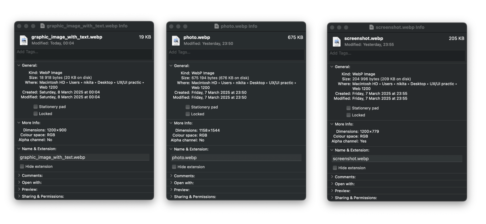

**Файли "Для вебу: максимальна ширина 1200 px"**

**Графічне зображення з текстом "Для вебу: максимальна ширина 1200 px"**

**Фотографія "Для вебу: максимальна ширина 1200 px"**

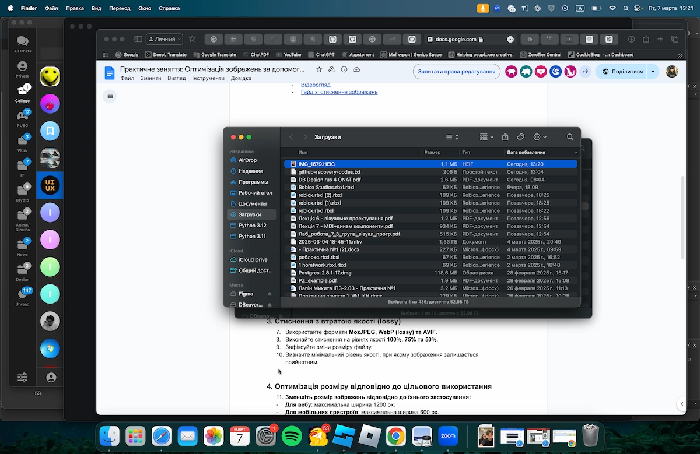

**Скріншот "Для вебу: максимальна ширина 1200 px"**

---

## Опис “Для мобільних пристроїв: максимальна ширина 600 px.”
### Дані про стиснення зображень

| Зображення                 | Формат | Якість | Оригінальна вага       | Вага після стиснення       | Розмір       | Відсоток стиснення |
|----------------------------|--------|--------|------------------------|--------------------|--------------|--------------------|
| Графічне зображення з текстом | WebP   | 100%   | 52013 bytes / 53 KB   | 34432 bytes / 37 KB  | 600×450     | **-34%**          |
| Фотографія                 | WebP   | 100%   | 1138131 bytes / 1.1 MB | 178864 bytes / 180 KB | 579×772    | **-84%**          |
| Скріншот                   | WebP   | 100%   | 3245717 bytes / 3.2 MB | 73412 bytes / 74 KB  | 600×390     | **-98%**          |

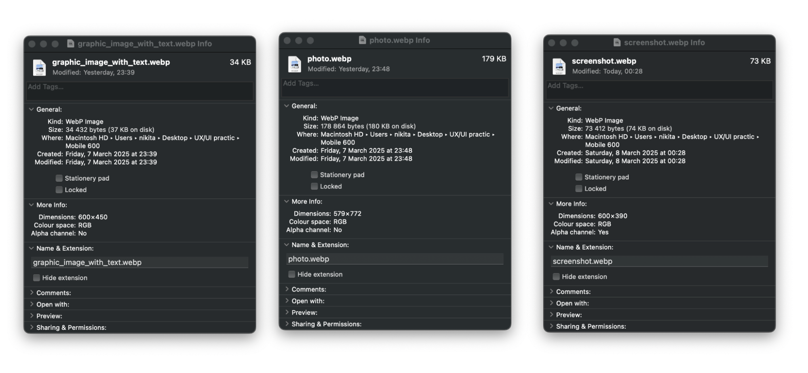

**Файли “Для мобільних пристроїв: максимальна ширина 600 px"**

**Графічне зображення з текстом "Для мобільних пристроїв: максимальна ширина 600 px"**

**Фотографія "Для мобільних пристроїв: максимальна ширина 600 px"**

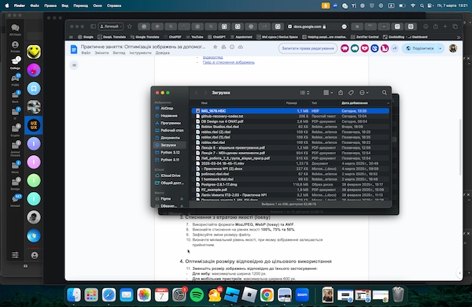

**Скріншот "Для мобільних пристроїв: максимальна ширина 600 px"**

---

## Опис “Для Retina-дисплеїв: створіть 2x версію зображення.”
### Дані про зміну ваги зображень

| Зображення                 | Формат | Якість | Оригінальна вага       | Вага після стиснення       | Розмір       | Відсоток зміни |
|----------------------------|--------|--------|------------------------|--------------------|--------------|----------------|
| Графічне зображення з текстом | WebP   | 100%   | 52013 bytes / 53 KB   | 224680 bytes / 225 KB  | 2400×1800   | **+332%**     |
| Фотографія                 | WebP   | 100%   | 1138131 bytes / 1.1 MB | 4229018 bytes / 4.2 MB | 4632×6176   | **+272%**     |
| Скріншот                   | WebP   | 100%   | 3245717 bytes / 3.2 MB | 2397346 bytes / 2.4 MB | 7200×4676   | **-26%**      |

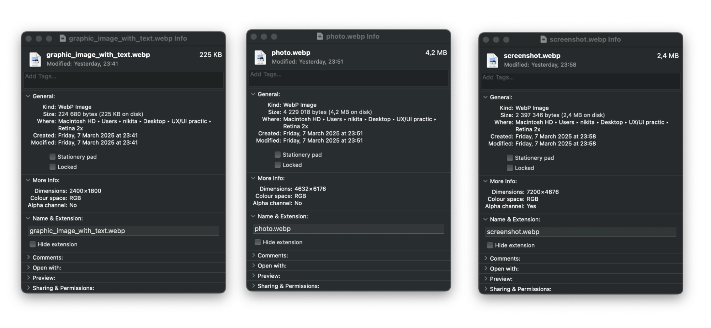

**Файли “Для Retina-дисплеїв: створіть 2x версію зображення”**

**Графічне зображення з текстом "Для Retina-дисплеїв: створіть 2x версію зображення"**

**Фотографія "Для Retina-дисплеїв: створіть 2x версію зображення"**

**Скріншот "Для Retina-дисплеїв: створіть 2x версію зображення"**

---

## Опис “Для Retina-дисплеїв: створіть 3x версію зображення.”
### Дані про зміну ваги зображень

| Зображення                 | Формат | Якість | Оригінальна вага       | Вага після стиснення       | Розмір       | Відсоток зміни |
|----------------------------|--------|--------|------------------------|--------------------|--------------|----------------|
| Графічне зображення з текстом | WebP   | 100%   | 52013 bytes / 53 KB   | 397158 bytes / 397 KB  | 3600×2700   | **+664%**     |
| Фотографія                 | WebP   | 100%   | 1138131 bytes / 1.1 MB | 7653056 bytes / 7.7 MB | 6948×9264   | **+572%**     |
| Скріншот                   | WebP   | 100%   | 3245717 bytes / 3.2 MB | **ERROR**           | 10800×7014  | **ERROR**      |

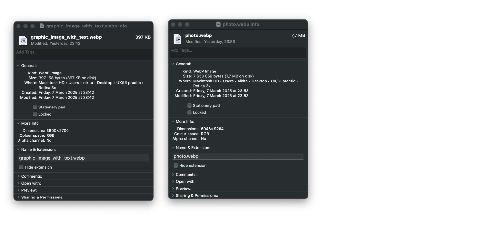

**Файли “Для Retina-дисплеїв: створіть 3x версію зображення”**

**Графічне зображення з текстом "Для Retina-дисплеїв: створіть 3x версію зображення"**

**Фотографія "Для Retina-дисплеїв: створіть 3x версію зображення"**

---

# Висновки щодо досліджень:

1. **Для вебу (максимальна ширина 1200 px):**
   - Стиснення зображень дозволяє значно зменшити розмір файлів: найкращий результат досягнуто зі скріншотами (-94%), що свідчить про ефективність застосування формату WebP для зменшення ваги без втрати якості.
   - Фотографії і графічні зображення з текстом також показали значне зменшення ваги (до -64% і -41% відповідно).

2. **Для мобільних пристроїв (максимальна ширина 600 px):**
   - Стиснення зображень для мобільних пристроїв виявилось ефективним, зниження ваги досягло -98% для скріншотів, що дозволяє значно зекономити пам’ять та швидше завантажувати контент на мобільних пристроях.
   - Графічні зображення з текстом мали зменшення на -34%, що все ж дозволяє зберегти достатню якість для мобільних екранів.

3. **Для Retina-дисплеїв (2x версія):**
   - Створення 2x версії для Retina-дисплеїв призвело до значного збільшення ваги файлів: для графічного зображення з текстом вага збільшилась на 332%, для фотографії на 272%. Це показує, що для високоякісних дисплеїв зображення мають значно більші розміри.
   - Скріншоти не мали значного збільшення ваги, що може бути пов’язано з їх роздільною здатністю.

4. **Для Retina-дисплеїв (3x версія):**
   - Створення 3x версії ще більше збільшує вагу файлів, що досягло +664% для графічного зображення і +572% для фотографії. Однак для скріншота виникла помилка при зміні розміру.
   - Це підкреслює високі вимоги до зберігання великих файлів для підтримки високоякісних дисплеїв 3x, що потребує більше ресурсів.

---

Загалом, стиснення для вебу та мобільних пристроїв показує значні переваги в зменшенні розміру файлів, тоді як для Retina-дисплеїв збільшення якості зображень призводить до значного збільшення їх ваги.

---

# Розгорнуті висновки щодо форматів та параметрів оптимізації для кожного типу зображень

## 1. Графічне зображення з текстом (ілюстрації, схеми, текстові зображення)

### Найкращі формати:
- **WebP lossless** – значне зменшення ваги (до 65%) без втрати якості.
- **AVIF lossy (75%)** – оптимальний баланс якості та ваги (-51%), мінімальна втрата чіткості тексту.
- **WebP lossy (100%)** – найгірший вибір, вага навіть збільшилась на 18%.
- **MozJPEG** – не підходить, спотворює текст навіть при високій якості.

### Оптимальні параметри:
- **Для без втрат:** WebP lossless.
- **Для стиснення з втратами:** AVIF 75% або WebP 50-75%.
- **Для Retina-дисплеїв:** версії 2x і 3x у WebP або AVIF.

---

## 2. Фотографія (реальні зображення, портрети, пейзажі)

### Найкращі формати:
- **WebP lossy (50%)** – найкращий компресійний результат, вага зменшилась на 80% без значної втрати якості.
- **AVIF lossy (75%)** – також хороший вибір (-62% ваги), менше артефактів, ніж WebP.
- **MozJPEG (50%)** – непоганий варіант, але втрата деталей при стисканні на 75%.
- **WebP lossless і PNG lossless** – значно збільшують вагу (до 8.6 МБ).

### Оптимальні параметри:
- **Для стиснення без помітної втрати якості:** AVIF (75%) або WebP (50-75%).
- **Для мінімальної втрати деталей:** WebP (75%) або AVIF (100%).
- **Для Retina-дисплеїв:** версії 2x і 3x у AVIF або WebP.

---

## 3. Скріншот (інтерфейси, UI, коди, таблиці)

### Найкращі формати:
- **AVIF lossy (100%)** – вага зменшилась на 80%, зображення залишилось чітким.
- **WebP lossy (100%)** – хороша якість, зменшення ваги на 75%.
- **MozJPEG (50%)** – сильна деградація тексту і графічних елементів, не рекомендовано.
- **WebP lossless** – зменшення ваги на 62%, найкращий варіант без втрат.

### Оптимальні параметри:
- **Для без втрат:** WebP lossless.
- **Для оптимального стиснення:** AVIF 100% або WebP 100%.
- **Для Retina-дисплеїв:** 2x і 3x версії у WebP або AVIF.

---

## Загальні висновки:
1. **WebP lossless** – найкращий для збереження якості текстових і графічних зображень.
2. **AVIF lossy (75-100%)** – ідеальний для стиснення без значної втрати якості.
3. **WebP lossy (50-75%)** – добре підходить для фотографій і скріншотів.
4. **MozJPEG** – можна використовувати тільки для фотографій, але є ризик втрати деталей.
5. **Retina-дисплеї** – найкращий вибір AVIF або WebP у 2x або 3x.

---

## Рекомендація:
- **Якщо важлива якість →** AVIF або WebP 100%.
- **Якщо потрібно максимально стиснути →** WebP 50% або AVIF 75%.
- **Для вебу та мобільних пристроїв →** WebP lossy (75%) або AVIF lossy (75%).

---

Посилання на звіт у [GoogleDocs](https://docs.google.com/document/d/1hSe84_EHsIP_7l0-9sNcZAwktLrZeaPT59A41KiEaG8/edit?usp=sharing).
Усі файли доступні в репозиторії на [GitHub](https://github.com/ni-cookie/image-optimization-squoosh).